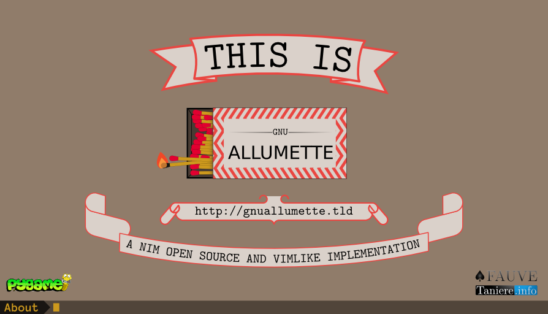

# Open Allumette


This version of the classic [Nim](https://en.wikipedia.org/wiki/Nim) game is made to be all used with the keyboard (like vim).

Later, it will support all possible knowen varients of this game.


⚠ if you were searching of dumb-friendly and WIMP interface, go away. Open Allumette is made for nerdz by a geek like if it was a programmer editor. And we are proud of that.

# Usage
There is two main type of actions: The game actions and the managin actions.

* In the game actions, the user tell witch movement he want to do. In general, you acess it by normal mode.
* In the managing actions, he do sometings like charging a new game, or changing game setting. In general, you access it by ex mode.

## Command Line
You have to tell Allumette from command line, there are several options:

| Command               | Usage                                                |
| --------------------- | ---------------------------------------------------- |
|  `-n` `--number`      |  The number of match or colums (default: 16)         |
|  `-v` `--varient`     |  The varient (default: Trivial)                      |
|  `-w`                 |  Mode, there is two values possibles `ttl` and `ltl` |

## Managing actions
All managing actions is in exmode, it means that the begin by `:`.

###Beging new game
In any situation, the syntax mainly follow this kind of structure

<pre>
:new <var>⟨varient⟩</var> <var>⟨number⟩</var> <var>⟨wtw⟩</var>
</pre>

* The <var>⟨varient⟩</var> is the name of varient, for example `marienbad` or `trivial`.
* <var>⟨wtw⟩</var> can take two values `ttl` (`take-the-last`) or `ltl` (`let-the-last`).
* <var>⟨number⟩</var> is number of match in the begining in the trivial varient and the number of column in the marienbourg varient (it is necessary odd).

Note that if you alredy in a party and you mispeled an option it will automaticly take the value in the current game.

For example, if you are playing a trivial mode with `ttl` and 20 matchs and you only type `:new` you will begin new game with the same settings.

###Other stuff

| Command                                                                                   | Usage                                       |
| ----------------------------------------------------------------------------------------- | ------------------------------------------- |
| `:about`                                                                                  |  Open the license screen                    |
| <code>:colorsheme <var>⟨varient⟩</var></code>                                             |  Change colorsheme.                         |
| `:quit` `:q` <kbd>Z</kbd><kbd>Z</kbd>                                                     |  Quit the game.                             |
| `:saveas` `:w`                                                                            |  Save the current game with time in a file. |
| `:open` `:o`                                                                              |  Open registered game                       |
| `:rules`                                                                                  |  Show the rules for the current varient.    |
| <code>:help <var>⟨commad⟩</var></code> <code>:h <var>⟨commad⟩</var></code>                |  Getting help about a command.              |
|  <kbd>p</kbd>                                                                             |  Put game on pause                          |
|  <var>⟨number⟩</var><kbd>u</kbd>                                                          |  Undo one (or <var>⟨number⟩</var>) last action.      |
|  <var>⟨number⟩</var><kbd>r</kbd>                                                          |  Redo one (or <var>⟨number⟩</var>) last undid action.|

## Game actions
The syntax of the game actions mainly depand of the variant you are playing. And in all cases, you have to be in normal mode; to get it, just press <kbd>⎋</kbd> key.

But there is on command in all varients. `:tip` witch show you what to do if you dont know what.

### In trivial mode
In this mode you have to take 1, 2, or 3 match. To do this you have two possibilities:

* You can explicitly indicate the number of match you whant to take, for this, just type the number of match followed by <kbd>⏎</kbd>. Optionnaly, the number of match you want to take could be precead by minus `-`.
* You can also indicate the number of match you hant to let. For this you just have to prefix the number of match by equal sign `=`.

### In Marienbad mode
In this mode, all the columns are numbered. So, you still have two possibilities to indicate how many match you whant to take and frow any column.

The sintax is the following:

<pre>
<var>⟨column number⟩</var>=<var>⟨match to let⟩</var><kbd>⏎</kbd>

<var>⟨column number⟩</var>-<var>⟨match to take⟩</var><kbd>⏎</kbd>
</pre>

### In Grundy mode
In grundy mode all initial pile is numbered and all child pile still get the number of her parent pile. So, if the user chose the pile #3, we get two pile witch is named `3.0` and `3.1`, and if he decide to play the pile 3.1 we will get the piles `3.1.0` and `3.1.1`.

So, if the user whant to play a pile, he just have to write his name and press <kbd>⏎</kbd>.

### In Wythoff mode
In this mode, there is two pile. The user have write to take the same number of match in the two pile together, or a number he want in one pile.

The two pile are named `a` and `b`.

So, the syntax to take the same number of match in the two piles is:
<pre>
[-]<var>⟨number of matchs to take⟩</var><kbd>⏎</kbd>
=<var>⟨number of matchs to let⟩</var><kbd>⏎</kbd>
</pre>

Alternativly, if the user whant to only take matchs from one pile, he have to use this syntax:
<pre>
<var>⟨Letter of the pile⟩</var>[-]<var>⟨number of matchs to take⟩</var><kbd>⏎</kbd>
<var>⟨Letter of the pile⟩</var>=<var>⟨number of matchs to let⟩</var><kbd>⏎</kbd>
</pre>

## Installation
For Debian and ManjaroLinux, you can install OpenAllumette by the [`install.sh` script](./install.sh) or with the following instruction:

### On Debian and Ubuntu
OpenAllumette work with python3 and need both python3 and python3’s version of pygame.

Install first needed packages with:

```
sudo aptitude install git python3 python3-pip
```

Install pygame for python3 with the `pip3` util:
```
pip3 install Pygame
```


Now, you can install OpenAllumette:
```
aptitude install git
git clone github.com/FauveNoir/allumette.git ~/.allumette
ln -s ~/.allumette/nim.py ~/.local/bin/allumette
```

You can now run OpenAllumette with the command `allumette`. Good game.


## Screenshots
### Trivial

### Prewin

### Wining

### About screen


## Bugs and stuffs to improve
* Allow historic of commands in ex mode with <kbd>↑</kbd> and <kbd>↓</kbd>.
* Showing error in ex mode.
* Allowing undo with <kbd>u</kbd> and redo with <kbd>r</kbd> with numerical prefix.
